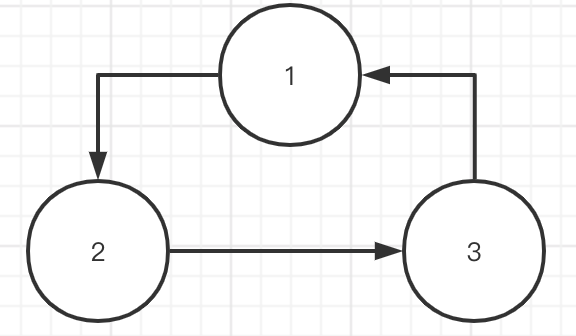

# dagflow
基于DAG的事件流flow驱动

## Usage
使用简单，常用就几个方法：
- **Add**: 添加任务节点至`DagFlow`中。
- **Connect**: 连接点与点之间的有向关系。
- **Validate**: DAG图校验，只有校验通过后才会执行后续步骤。
- **Run**: 执行DAG图事件流。

> Job节点需要重载以下函数，详细参加`example.go`:
> ```Go
>type JobNode interface {
>	// 事件处理
>	Exec()
>	// 事件处理完成后调用
>	Complete()
>	// 函数唯一编号
>	dag.Hashable
>	// 是否完成
>	IsFinished() bool
>	// 设置结果
>	SetFinished(bo bool)
>	// 节点唯一编号
>	GetTaskID() uint64
>}
> ```

## Example 1

上图中，明显不是有向无环图，因为存在两个root节点`1`和`2`，所以在执行`Validate`时会报多个root节点的错。
完整用例见：[examples/ex1/ex1.go](examples/ex1/ex1.go)

## Example 2

上图中，主要展示的是无根节点的情况，也就是这个是循环的，所以在执行`Validate`时会报找不到root节点。
完整用例见：[examples/ex2/ex2.go](examples/ex2/ex2.go)

## Example 3

上图中，是一个比较简单的有向无环图，在执行`Run`时，执行顺序会如图所示，依次执行`1`、`2`、`3`。
完整用例见：[examples/ex3/ex3.go](examples/ex3/ex3.go)

## Example 4


上图中，是一个比较简单的有向无环图，在执行`Run`时，当检测到一个节点后有多个分支的情况时，会采用并发的形式去执行后续的节点，所以执行顺序会是先执行`1`，然后同时执行`2`和`3`。
完整用例见：[examples/ex4/ex4.go](examples/ex4/ex4.go)

## Example 5

上图中，是一个相对复杂的有向无环图，结合`Example 3`和`Example 4`的情况，执行顺序是首先执行`1`，随后并行执行`2`、`3`、`4`，此时执行完`4`后，就准备执行`6`，但检测到要执行`6`的前提会是先执行完成`5`，所以后面的顺序是执行完`5`后再执行`6`。
完整用例见：[examples/ex5/ex5.go](examples/ex5/ex5.go)


> 如果这个小工具对你有帮助的话欢迎留个Star鼓励一下，😆